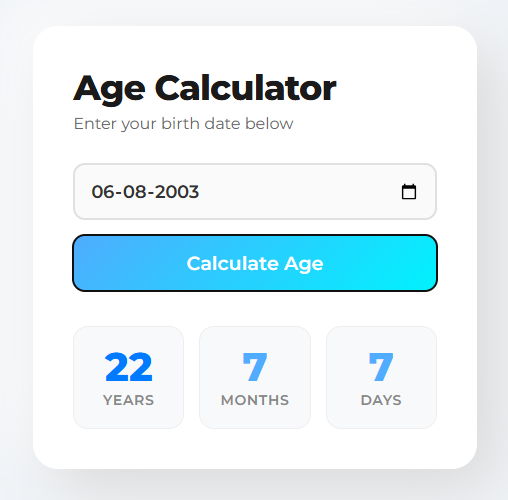
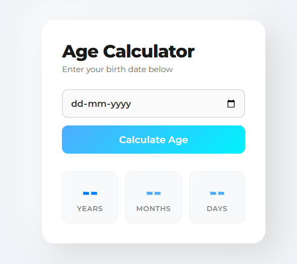

# CodeAlpha Ultimate Age Calculator

A lightweight, browser-based age calculator that instantly tells you your age in years, months, and days based on your birthdate.

---

## 🚀 Features

- **Easy input**: Pick your birth date via a native date picker.
- **Instant result**: Click **Calculate Age** to get your age in years, months, and days.
- **Pure web**: No backend required — runs fully in the browser.

---

## 🧪 Screenshots

| With Date Selected | Without Date Selected |
|---|---|
|  |  |

---

## ▶️ How to Use

1. Open `index.html` in any modern browser.
2. Select your birth date using the date picker.
3. Click **Calculate Age**.
4. Your age will appear in the result boxes.

---

## 🛠️ Project Structure

- `index.html` – UI layout
- `style.css` – styling
- `script.js` – age calculation logic
- `images/` – screenshots used in this README

---
